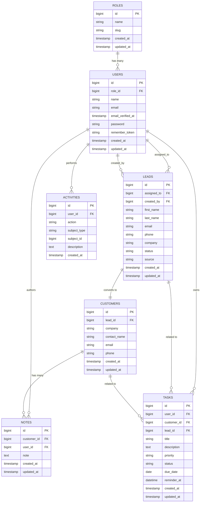

# Entity-Relationship Diagram

This diagram reflects the actual database schema as defined by the migrations in `database/migrations/`.

> **Note on `ACTIVITIES`:** the `subject_type` / `subject_id` pair is a polymorphic reference (Laravel "morph" pattern), not a single-table foreign key. It can point to a `LEADS`, `CUSTOMERS`, `TASKS`, or `NOTES` row depending on `subject_type`. This is shown above only as an attribute pair, not as a drawn relationship, since Mermaid ER diagrams cannot express polymorphic associations directly.

## Database Design

- **Roles → Users (1:N):** Each user optionally belongs to one role (`users.role_id`, nullable, `nullOnDelete`). A role can be assigned to many users. This implements simple role-based access control rather than a many-to-many permissions table.
- **Users → Leads (1:N, two relationships):** A lead has a required creator (`created_by`, `cascadeOnDelete`) and an optional assignee (`assigned_to`, `nullOnDelete`). Both columns reference `users.id`, so a user can create or be assigned many leads.
- **Leads → Customers (1:1):** A customer record is created once a lead converts; `customers.lead_id` is unique and `cascadeOnDelete`, enforcing exactly one customer per lead and removing the customer if the source lead is deleted.
- **Customers → Notes (1:N):** A customer can have many notes (`notes.customer_id`, `cascadeOnDelete`); each note also tracks its author via `notes.user_id`.
- **Users → Tasks (1:N) and optional links to Leads/Customers:** Every task belongs to one owning user (`tasks.user_id`, `cascadeOnDelete`), and may optionally relate to a `lead_id` and/or `customer_id` (both nullable, `nullOnDelete`), allowing tasks to be tracked against either pipeline stage.
- **Users → Activities (1:N):** Every activity (audit/event log entry) is tied to the acting user (`activities.user_id`, `cascadeOnDelete`) and references its subject polymorphically via `subject_type` + `subject_id`, so a single `activities` table can log events against leads, customers, tasks, or notes without separate foreign keys per entity.

Cascade behavior follows two patterns: deleting a **lead** or **customer** cascades to its dependent rows (customers, notes), while deleting a **user** referenced as an optional assignee/owner (`assigned_to`, task/customer/lead links) sets those references to null instead of deleting the dependent record.
